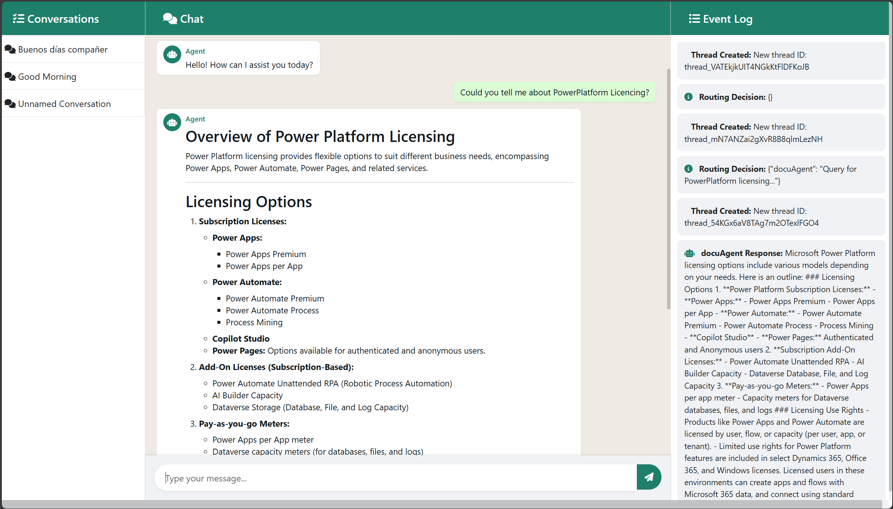

# Python App

## Overview

This Python application is designed to provide an interactive chat interface that leverages Azure services for intelligent query handling and response synthesis. The application uses multiple AI agents to process user queries, route them to the appropriate agents, and synthesize the final response. It integrates with Azure Cosmos DB for session management and conversation history, Azure AI Services for creating and managing AI agents, and Azure Cognitive Search for retrieving detailed information on various topics.

Key features of the application include:

- **Interactive Chat Interface:** A user-friendly chat interface built with FastAPI and Jinja2 templates.
- **Multi-Agent System:** Utilizes multiple AI agents, each with a specific role, to handle different aspects of user queries.
- **Azure Integration:** Seamlessly integrates with Azure services for authentication, data storage, and AI capabilities.
- **Session Management:** Uses Azure Cosmos DB to manage user sessions and store conversation history.
- **Response Synthesis:** Synthesizes coherent and concise responses based on the input from multiple agents.
- **Containerized Development:** Supports a DevContainer configuration for a consistent development environment.

The application is designed to be modular and scalable, making it easy to extend and customize for various use cases.

## Features

- **Azure Authentication:** Uses `DefaultAzureCredential` to automatically select the appropriate authentication method based on the environment.
- **Environment Configuration:** Requires a `.env` file for storing sensitive credentials and configuration variables.
- **Containerized Development:** Includes a DevContainer configuration for a ready-to-use development environment in Visual Studio Code.
- **Modular Design:** Organized project structure for clarity and ease of maintenance.

## Prerequisites

- **Python:** Version 3.7 or later.
- **Azure Subscription:** Ensure you have valid Azure credentials.
- **Docker:** Required for using the DevContainer (optional but recommended).
- **VS Code:** With the [Remote - Containers extension](https://code.visualstudio.com/docs/remote/containers) if you plan to use the DevContainer.
- **Pip:** For managing Python packages.

## Getting Started

### 1. Clone the Repository

```bash
git clone https://github.com/frdeange/skmultiagent.git
cd your-repository
```

### 2. Set Up a Virtual Environment and Install Dependencies

It is recommended to use a virtual environment:

```bash
python -m venv venv
source venv/bin/activate  # On Windows use: venv\Scripts\activate
pip install -r requirements.txt
```

Alternatively, you can use the DevContainer for a consistent development environment:

1. **Install Docker:** Make sure Docker is installed and running on your machine.
2. **Install VS Code:** Install Visual Studio Code.
3. **Install Remote - Containers Extension:** In VS Code, install the Remote - Containers extension.
4. **Open the Project in a Container:**
   - Open the project folder in VS Code.
   - When prompted, select “Reopen in Container” to start the DevContainer.

The DevContainer configuration is located in the `.devcontainer` directory and includes all necessary settings for a consistent development environment.

### 3. Create a `.env` File

The application requires a `.env` file in the root directory to load sensitive credentials and other configuration variables. Create a file named `.env` and include the following environment variables:

```ini
# Azure AI Foundry Details
AZURE_AI_AGENT_PROJECT_CONNECTION_STRING="YOURPROJECTCONNECTIONSTRING"
AZURE_AI_AGENT_MODEL_DEPLOYMENT_NAME="gpt-4o"

# Azure AI Search Info
AZURE_SEARCH_CONNECTION_ID="YOURCONNECTIONID" #Only needed if you have more than one Azure AI Search connected to the AI Project in Azure AI Foundry
AZURE_SEARCH_INDEX_NAME="YOURINDEXNAME"

# Monitoring Info
APPINSIGHTS_INSTRUMENTATION_KEY="YOURAPPINSIGHTKEY"


# CosmodDB Information
COSMOS_ENDPOINT="YOURCOSMOSDBURL/"
COSMOS_KEY="YOURCOSMOSDBKEY" #Only needed if you have key access enabled on your CosmosDB
COSMOS_DB_NAME="YOURDATABASENAME"
COSMOS_CONTAINER_NAME="YOURCONTAINERNAME"

# Additional configuration variables (if any)

```

**Note:** You can use the provided `.env.example` as a reference.

### 4. Running the Application

To run the application, execute the main module:

```bash
python app.py
```

Ensure that your `.env` file is correctly set up so that the application can load the necessary configuration variables.

## Azure Authentication with `DefaultAzureCredential`

The application uses the `DefaultAzureCredential` class from the `azure.identity` package. This class simplifies the process of authentication by automatically determining the best available credential based on the environment. During local development, it relies on the credentials provided in your `.env` file (or your local Azure CLI session), and in production, it can utilize managed identities or other secure methods.

If you're using this repo in local, please do:

```bash
az login
```
If you're using DevContainer, Azure CLI is pre-installed. If not, install Azure CLI in your environment before try the login.

Ensure your Azure credentials are valid and that you have the necessary permissions to access the Azure resources required by the application.

## Using the DevContainer

For an optimized development experience, the project includes a DevContainer configuration. This allows you to run the application within a Docker container that has all the required dependencies and configurations pre-installed.

## Cloud Services Requirements

To deploy and run this application, you will need the following Azure services:

1. **Azure Cosmos DB:**
   - Used for storing session data, conversation history, and other persistent information.
   - Ensure you have a Cosmos DB account and the necessary connection strings.

2. **Azure AI Foundry:**
   - Required for creating and managing AI agents.
   - You have to create a Project and extract the 
   - Ensure you have the necessary Azure AI resources and connection strings. Please, follow up this [QuickStart guide](https://learn.microsoft.com/en-us/azure/ai-services/agents/quickstart?pivots=programming-language-python-azure) to setup your environment 

3. **Azure Cognitive Search:**
   - Used by the `docuAgent` to retrieve detailed and concise information on various Microsoft products.
   - Ensure you have an Azure Cognitive Search service and the necessary connection strings.
   - You have to create an index in your search service and link it to your project. 
      - To create the index, you can use this [QuickStart guide](https://learn.microsoft.com/en-us/azure/search/search-get-started-portal-import-vectors?tabs=sample-data-storage%2Cmodel-aoai%2Cconnect-data-storageQuickStart) for Azure AI Search. **NOTE**: Please, do not add additional skills to the AI Search while vectoring. Do not add any image, or Layout detection as the AI Agent Service cannot read that properties right now (Azure AI Agent Service is on preview on the moment of this project.)
      - To create the Project Connection to the Azure AI Search, please [follow this guide](https://learn.microsoft.com/en-us/azure/ai-services/agents/how-to/tools/azure-ai-search?tabs=azurecli%2Cpython&pivots=overview-azure-ai-search)


4. **Azure Identity:**
   - The application uses `DefaultAzureCredential` for authentication.
   - Ensure you have the necessary Azure credentials (Client ID, Tenant ID, Client Secret) and permissions to access the required Azure resources.

Make sure to configure these services and update your `.env` file with the appropriate connection strings and credentials.

## Project Structure

Below is an example of the project structure:

```plaintext
├── app.py                    # Main entry point of the application
├── aux/                      # Auxiliary files
│   └── cinemasapi.json       # JSON file for cinema API Declared on OpenAPI 3.0
├── modules/                  # Modules directory
│   └── cosmos_db.py          # CosmosDB module
├── static/                   # Static files directory
│   └── css/                  # CSS styles
│       └── styles.css
│   └── js/                   # JavaScript files
│       └── scripts.js
├── templates/                # Templates directory
│   └── index.html            # HTML template
├── .env.example              # Example file for environment variables
├── requirements.txt          # List of Python dependencies
└── README.md                 # This file
```

## Agents Description

The application consists of several agents, each with a specific role and functionality. Below is a description of each agent:

1. **CoordinatorRouting Agent:**
   - **Role:** Acts as a routing coordinator.
   - **Functionality:** Analyzes the user's query and outputs a JSON object that maps agent names to the sub-query they should answer. It ensures that only relevant agents are included in the response.

2. **CoordinatorSynthesis Agent:**
   - **Role:** Acts as a synthesis coordinator.
   - **Functionality:** Synthesizes a final, coherent, and concise answer for the user based on the original query and the responses from the delegated agents. It organizes the answer into appropriate sections without including any JSON or extra markup.

3. **docuAgent:**
   - **Role:** Expert on Microsoft Licensing products.
   - **Functionality:** Integrated with Azure AI Search to retrieve detailed and concise information on various Microsoft products such as Windows Server, Dynamics, PowerPlatform, among others. If no relevant information is found, it responds with an appropriate message.

4. **movieAgent:**
   - **Role:** Expert in cinema information.
   - **Functionality:** Uses a provided API tool to retrieve current movies, showtimes, and cinema details. It responds with relevant movie or cinema information, indicating the total number of movies available and listing the first 10 in alphabetical order. If asked about a specific title, it searches for it in the complete list and provides detailed information.

These agents work together to handle user queries, route them to the appropriate agents, and synthesize the final response, ensuring a seamless and efficient interaction.

## Troubleshooting

### Azure Authentication Issues

- Verify that your `.env` file contains the correct values for each variable. You can use the refered .env.example file for your records.
- Ensure these credentials have the proper permissions to access the required Azure resources.

### DevContainer Issues

- Ensure Docker is installed and running.
- Confirm that the Remote - Containers extension is installed in VS Code.
- Check the logs within the DevContainer for any errors related to dependency installation or configuration.

## Contributing

Contributions are welcome! If you would like to contribute, please follow these steps:

1. Fork the repository.
2. Create a new branch for your feature or bugfix.
3. Commit your changes and open a pull request.
4. Ensure your code adheres to the project's style and testing guidelines.

## License

This project is licensed under the MIT License. See the `LICENSE` file for more details.

## Images




